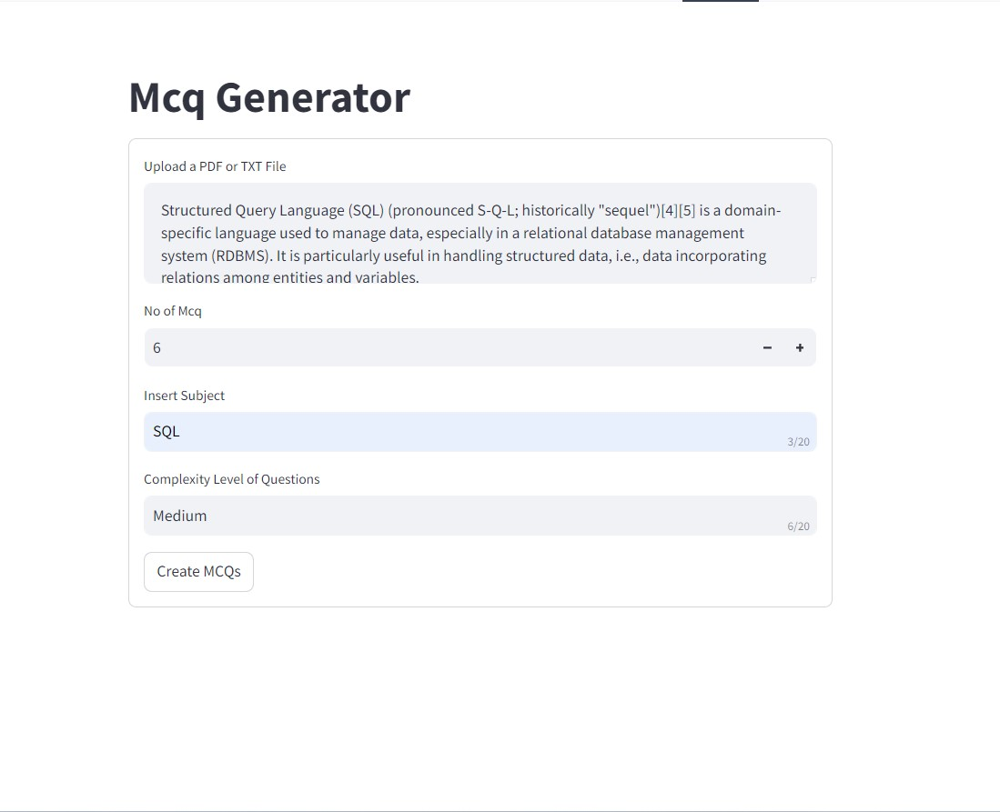
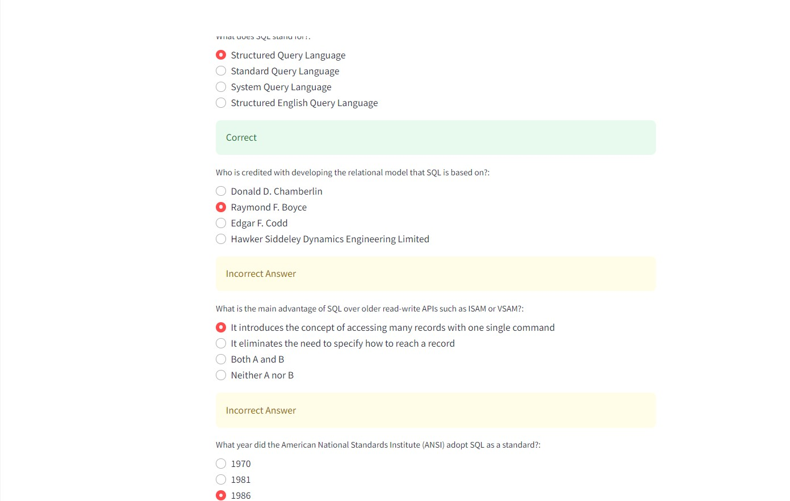

## MCQ Generator
This repository contains a script for automatically generating Multiple Choice Questions (MCQs) from input text files. It can be used to generate questions for quizzes, assessments, and educational purposes.
Link:https://huggingface.co/spaces/ashu2000/MCQGENERATOR




## Features
- Generate multiple choice questions based on input text or content.
- Automatically create distractors (incorrect options) for the generated questions.
- Export questions in various formats text for easy integration into different platforms.
- Supports customization of question difficulty and type.

## Installation
To use the MCQ Generator, clone the repository and install the required dependencies.

## Prerequisites
Python 3.7+
pip (Python package installer)

## Clone the Repository
```bash
git clone https://github.com/ashutosh15072000/mcqgenator.git
cd mcqgenerator
```
## Install Dependencies
```bash
pip install -r requirements.txt
```
## Options
- input: Path to the input text file or source.
- output: Path to the output file .
- num-questions: Number of questions to generate (optional).
- difficulty: Difficulty level of the questions (easy, medium, hard).

## Examples
Here are some example outputs generated by the MCQ Generator:

1 Input Text:
```bash
Python is a high-level, interpreted programming language known for its easy-to-read syntax and dynamic typing. It was created by Guido van Rossum and first released in 1991.
```
## Generated MCQ:

Question: Who created Python?

- A) Guido van Rossum
- B) James Gosling
- C) Dennis Ritchie
- D) Bjarne Stroustrup
Answer: A) Guido van Rossum
